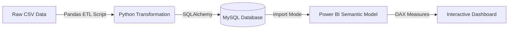

# Apex Capital: Financial Analytics Dashboard Template (ETL + Power BI)

**A Prototype for Merging Financial Data with ESG Metrics**


## Project Overview

This project serves as a functional **prototype and template** for building a scalable financial decision support system. It demonstrates how to transition from fragile, static Excel reporting to a robust, full-stack data pipeline using **Python, SQL, and Power BI**.

The specific use case focuses on **"Dual-Mandate Investing"** screening S&P 500 stocks based on both financial value (P/E Ratio, Dividends) and ethical alignment (ESG Risk Scores). However, the architecture is domain-agnostic and designed to be a starting point for more complex enterprise needs involving historic data and live feeds.

---

## The Architecture (How it Works)

Instead of the common "drag-and-drop CSV" approach, this project simulates a secure enterprise data environment.


1. Storage Layer (MySQL): I enforce data integrity by loading data into a relational database rather than relying on flat files. This ensures strict typing (e.g., BIGINT for Market Cap, DECIMAL for Prices) and schema consistency.

```SQL
-- Creating the database schema
CREATE DATABASE IF NOT EXISTS wealth_management_dss;
USE wealth_management_dss;

-- Dropping table if it exists to avoid errors.
DROP TABLE IF EXISTS investment_universe;

-- Creating the table matching the Pandas DataFrame structure (23 columns)
CREATE TABLE investment_universe (
    -- PRIMARY KEY
    symbol VARCHAR(10) NOT NULL,
    
    -- TEXT FIELDS
    company_name VARCHAR(255),
    sector VARCHAR(100),
    industry VARCHAR(100),
    
    -- FINANCIAL METRICS (Decimal for precision)
    current_price DECIMAL(10, 2),
    pe_ratio DECIMAL(10, 2), -- Price/Earnings
    dividend_yield DECIMAL(10, 4),
    earnings_per_share DECIMAL(10, 2),
    week_52_high DECIMAL(10, 2),
    week_52_low DECIMAL(10, 2),
    market_cap BIGINT, -- Market Cap is too large for INT
    ebitda BIGINT,
    price_to_sales DECIMAL(10, 4),
    price_to_book DECIMAL(10, 2),
    
    -- ESG METRICS (Float/Decimal)
    total_esg_risk DECIMAL(5, 2),
    environment_risk DECIMAL(5, 2),
    governance_risk DECIMAL(5, 2),
    social_risk DECIMAL(5, 2),
    
    -- ESG CATEGORICAL/ORDINAL
    controversy_level VARCHAR(50),
    controversy_score DECIMAL(3, 1),
    esg_risk_percentile DECIMAL(5, 2),
    esg_risk_level VARCHAR(50),
    
    -- PROPRIETARY DATA
    proprietary_score INT,

    PRIMARY KEY (symbol)
);
```

2. ETL Layer (Python): The "Extract, Transform, Load" process is handled via Python script. This layer is responsible for:

    1. Data Cleaning: Regex parsing to standardize categorical text (e.g., "Severe Controversy" $\to$ "Severe").
    2. Logic Correction: Algorithmic identification and swapping of inverted columns (e.g., where Low > High).
    3. Simulation: Generating "Proprietary Analyst Scores" to mimic the integration of internal private data with public market data.
       

```python
import pandas as pd
import numpy as np

# Extraction process
try:
    df_financials = pd.read_csv(r"C:\Users\your_user\your_folder\constituents-financials_csv.csv")
    df_esg = pd.read_csv(r"C:\Users\your_user\your_folder\SP 500 ESG Risk Ratings.csv")
except FileNotFoundError as e:
    print(f"Error: {e}")
    exit()

# Analysis of Financials (df_financials)
print("Analysis: Financials (df_financials)")
print("\n Info Schema and Data Types:")
df_financials.info()
print("\n Head Sample Data:")
print(df_financials.head())

# Statistical summary of numeric columns
print("\n Numeric Statistics:")
print(df_financials.describe())

# Main Finding: 
# 
# Two columns are inverted. The 52 Week Low and 52 Week High columns have logical differences. The describe statistics confirs that the mean for Low $122.62 > mean High $83.53. Therefore, in our transformation process will swap them.
# 
# Minor Issues:
# 
# Nulls: There are minor, acceptable data gaps. 2 companies are missing Price/Earnings (505 - 503 = 2), and 8 are missing Price/Book (505 - 497 = 8). This isn't an error, it's just incomplete data we'll have to live with.
# 
# Cleanup: The SEC Filings column is confirmed as object (text) and is not needed for our KPIs. It will be dropped.
# 
# File Quality: Our output shows Price/Earnings is already a float64 (numeric), which is good. The file is cleaner than we might have assumed.

# Analysis of ESG (df_esg)
print("Analysis: ESG (df_esg)")
print("\n Info Schema and Data Types:")
df_esg.info()
print("\n Head Sample Data:")
print(df_esg.head())

# checking text-based columns we need to clean
print("\n Unique 'Controversy Level' values:")
print(df_esg['Controversy Level'].unique())

print("\n Unique 'ESG Risk Percentile' values (first 10):")
print(df_esg['ESG Risk Percentile'].unique()[:10])

# Main Finding: 
# 
# Large Data Gaps. This file is missing a lot of data. Out of 503 companies, 73 are missing all primary ESG data (Total ESG Risk score is 430 non-null). This is a major limitation (503 - 430 = 73). These NaN values are not errors, but they confirm a large portion of the companies are "Not Rated."
# 
# Main Finding: Dirty Text Columns. The unique outputs confirm our cleaning plan is necessary.
# 
# Controversy Level: The values are verbose (e.g., 'Moderate Controversy Level'). We must strip the "Controversy Level" suffix.
# 
# ESG Risk Percentile: This is an object (text) column, not numeric (e.g., '50th percentile'). We will have to extract the number.
# 
# Cleanup and Redundancy:
# 
# Redundant Columns: The result shows Name and Sector columns, however our df_financials file already has these. Since df_financials is our base table (our "source of truth"), the Name and Sector in this file are redundant. We will drop them to prevent a merge conflict (which would create Name_x, Name_y columns).
# 
# Useless Columns: Address, Full Time Employees, and Description are useless for our KPIs. They're long text fields we can't score or filter on, so they will be dropped.
# 
# Useful Column: Industry (e.g., "Solar") is not in the financial file and is not redundant. It's valuable data for user filtering, so we will keep this column.
# 
# File Mismatch: This file has 503 entries; the financial file has 505. This confirms our LEFT JOIN strategy is correct. The two companies from the financial list that aren't in this file will correctly show NaN for all ESG fields.

# #### ***Null Value Analysis (Pre-Transform)***

print("\nFinancials Nulls:")
print(df_financials.isna().sum())

print("\nESG Nulls:")
print(df_esg.isna().sum())

# Financials (df_financials): The nulls are exactly as we thought. They are minor and acceptable: 2 nulls for Price/Earnings and 8 for Price/Book. This show incomplete data, but not a big issue.
# 
# ESG (df_esg): This confirms the major data gap. The key KPI columns (Total ESG Risk score, Environment Risk Score, Controversy Level, etc.) are all missing 73 records. This is the "Not Rated" group we identified.
# 
# It also shows that Controversy Score is in even worse shape, with 100 nulls. This just reinforces that the ESG data is spotty, but it doesn't change our plan.

# #### ***Simulate Proprietary Data (df_proprietary)***

print("Simulating Proprietary Data")

# We are going to use symbols from the financials file to ensure a perfect match
symbols = df_financials['Symbol'].unique()

# Let's now generate a random "Proprietary Values Score" between 40 and 100
np.random.seed(42) # Use a seed for consistent, repeatable results
prop_scores = np.random.randint(40, 101, size=len(symbols))

df_proprietary = pd.DataFrame({'Symbol': symbols, 'Proprietary Values Score': prop_scores})

print(f"Simulated {len(df_proprietary)} proprietary scores.")
print("Verifying head of simulated data:")
print(df_proprietary.head())

# Result: 
# 
# The simulation was successful. It created a new df_proprietary dataframe with 505 records, one for each Symbol in our df_financials base table. The head() output confirms the Proprietary Values Score column is populated with random integers.
# 
# Why are we doing this? We're simulating this data because the Proprietary Values Score is a critical KPI from our Part 1 business plan. We must have this column to prove our DSS can work as designed. Since we don't have a real file of internal scores, simulating it is the only way to test our complete ETL process. Using the df_financials['Symbol'] as the key guarantees it has the exact same 505 companies as our base table, ensuring a technically perfect merge.
# 
# Why isn't this introducing bias? Since this data itself is 100% fake and has no real-world correlation, we would not worry about this aspect right now. It's just random numbers. This doesn't introduce bias for the purpose of this project because our goal right now is not to find actual investment insights. Our goal is to prove the technical capability of our ETL process and DSS.

# #### ***Transformation***

print("Transforming Data (based on analysis)")

# T1: Fix inverted '52 Week Low' and '52 Week High' in df_financials
print("T1: Fixing inverted 52-week columns...")
df_financials.rename(columns={
    '52 Week Low': 'temp_high',
    '52 Week High': '52 Week Low'
}, inplace=True)
df_financials.rename(columns={
    'temp_high': '52 Week High'
}, inplace=True)

# T2: Handleling 'Price/Earnings' and convert to numeric
# Ensuring the 2 nulls from Block 5 are handled correctly
print("T2: Cleaning 'Price/Earnings'...")
df_financials['Price/Earnings'] = pd.to_numeric(df_financials['Price/Earnings'], errors='coerce')

# T3: Cleanning 'Controversy Level' strings in df_esg
print("T3: Cleaning 'Controversy Level'...")
df_esg['Controversy Level'] = df_esg['Controversy Level'].astype(str).str.replace(' Controversy Level', '').str.strip()

# T4: Cleanning 'ESG Risk Percentile' strings in df_esg
print("T4: Cleaning 'ESG Risk Percentile'...")
# Use regex to extract only the digits, then convert to float
df_esg['ESG Risk Percentile'] = df_esg['ESG Risk Percentile'].astype(str).str.extract(r'(\d+)').astype(float)

# T5: Field Selection (Dropping unnecessary columns)
print("T5: Dropping unneeded and redundant columns...")
# Dropping from financials:
df_financials = df_financials.drop(columns=['SEC Filings'])

# Dropping from ESG (keeping 'Industry' as we discussed):
df_esg = df_esg.drop(columns=[
    'Name',                 # Redundant with financials
    'Address',              # Useless for KPIs
    'Sector',               # Redundant with financials
    'Full Time Employees',  # Useless for KPIs
    'Description'           # Useless for KPIs
])

print("\nTransformation complete.")
print(f"VERIFY: df_financials columns: {list(df_financials.columns)}")
print(f"VERIFY: df_esg columns: {list(df_esg.columns)}")

# #### ***Verification (Post-Transform)***

print("--- Verifying Transformations ---")

print("\nFinancials Numeric Stats (Post-Transform):")
# This check proves the 52-week columns are fixed.
# The mean High should now be > mean Low.
print(df_financials[['52 Week Low', '52 Week High']].describe())

print("\nFinancials Info (Post-Transform):")
# This check proves 'Price/Earnings' is now float64
df_financials.info()

print("\nESG Unique Values (Post-Transform):")
# This check proves 'Controversy Level' is clean
print(df_esg['Controversy Level'].unique())

print("\nESG Head (Post-Transform):")
# This check proves 'ESG Risk Percentile' is now a number (float64)
# and that 'Industry' was kept.
print(df_esg.head())

# Main Fix Verified: 
# 
# The output confirms our primary fix. The 52 Week High (mean $122.62) is now correctly greater than the 52 Week Low (mean $83.53). The columns are no longer inverted.
# 
# Text Cleanup Verified: The [ESG Unique Values] output proves our string cleaning worked. The Controversy Level column is now a clean list of single-word categories (['Moderate', 'Low', 'Severe', 'None', 'Significant', 'High']) instead of verbose sentences.
# 
# Numeric Conversion Verified: The [ESG Head] output shows ESG Risk Percentile is now a clean number (e.g., 50.0, 66.0), not a text string. The [Financials Info] block also confirms Price/Earnings is correctly typed as float64.
# 
# Column Selection Verified: The [ESG Head] output confirms our plan to keep the Industry column was successful.

# #### ***Load (Merge)***

print("Loading (Merging) Data")

# L1: We will merge Financials (base) with ESG data
# Using a LEFT JOIN to keep all 505 financial records
print("Merging Financials and ESG data (LEFT JOIN)...")
df_merged = pd.merge(df_financials, df_esg, on='Symbol', how='left')

# L2: Then we will merge the result with Proprietary data
# Using a LEFT JOIN again to keep all 505 records
print("Merging result with Proprietary data (LEFT JOIN)...")
df_final = pd.merge(df_merged, df_proprietary, on='Symbol', how='left')

print(f"Merge complete. Final dataframe has {len(df_final)} rows.")
print("--- Verifying head of final merged data ---")
print(df_final.head())

# Row Count: The output Merge complete. Final dataframe has 505 rows. confirms our logic was sound. We started with 505 financial records, joined them against 503 ESG records and 505 proprietary records, and correctly ended with 505 rows. No companies were lost.
# 
# Schema: The head() output is the first look at our final, unified dataset. It visually confirms that all our key columns from all three sources are now in a single row for each company:
# 
# Financial data (e.g., Price, 52 Week High/Low)
# 
# ESG data (e.g., Industry, Total ESG Risk score)
# 
# Proprietary data (e.g., Proprietary Values Score)
# 
# No Conflicts: Critically, there are no Name_x, Name_y columns. This proves that our transformation step to drop the redundant Name and Sector columns from the ESG file was the correct decision and prevented a messy merge.

# #### ***Final Analysis (Merged Data)***

print("--- Final Analysis of Merged Data ---")

print("\nFinal Schema and Data Types:")
df_final.info()

print("\nFinal Null Counts (Post-Merge):")
print(df_final.isna().sum())

# Main Finding: 
# 
# Critical Data Mismatch. This is the most important finding of the entire ETL process. The [Final Null Counts] show 137 nulls for Total ESG Risk score and all other key ESG fields. This proves our two Kaggle files are not clean subsets of each other. This is the real-world data problem that we would face.
# 
# Here's the evidence from the numbers:
# 
# Our df_esg file (Block 4) had 430 companies with ESG scores.
# 
# Our final unified file only has 368 companies with ESG scores (505 total rows - 137 nulls).
# 
# This means 62 companies (430 - 368) that had an ESG score were discarded during the merge. Why? Because their Symbols (ticker) didn't exist in our df_financials base file.
# 
# This also means 137 companies from our df_financials base file have no ESG data. This is the true number of "Not Rated" companies in our final universe.
# 
# This isn't a failure. This is the finding. We were able to identified and quantified a major data integrity issue particularly in this case. Our final dataset for the dashboard will be based on the 368 companies where we have a complete match.
# 
# Minor Findings:
# 
# The original Price/Earnings (2 nulls) and Price/Book (8 nulls) counts are unchanged. This is correct.
# 
# Proprietary Values Score has 0 nulls, which is correct for our simulation.
# 
# Conclusion: The data is now fully unified. We have all the evidence for our report, including the critical mismatch we just found. All analysis is complete.

# #### ***Save Output Files***

print("Saving Output Files")
df_final.to_csv(r"C:\Users\your_user\your_folder\pdss_unified_dataset.csv", index=False)

# Saving the 100-record sample for the assignment submission
df_final.head(100).to_csv("rC:\\Users\your_user\your_folder\pdss_data_sample.csv", index=False)
print("\nSuccessfully created 'pdss_unified_dataset.csv' and 'pdss_data_sample.csv'")
print("--- ETL Process Complete ---")

# #### ***Loading to MySQL***

from sqlalchemy import create_engine

# Database Connection Configuration
db_user = 'root'
db_password = 'password'
db_host = 'localhost'
db_port = '3306'
db_name = 'wealth_management_dss'

# Creating SQLAlchemy Engine
connection_str = f"mysql+pymysql://{db_user}:{db_password}@{db_host}:{db_port}/{db_name}"
engine = create_engine(connection_str)

print("Loading Data into MySQL Database")

# We need to rename columns to match the SQL Schema format (removing spaces/slashes)
df_sql = df_final.copy()
df_sql.columns = [
    'symbol', 'company_name', 'sector', 'current_price', 'pe_ratio', 
    'dividend_yield', 'earnings_per_share', 'week_52_high', 'week_52_low', 
    'market_cap', 'ebitda', 'price_to_sales', 'price_to_book', 'industry', 
    'total_esg_risk', 'environment_risk', 'governance_risk', 'social_risk', 
    'controversy_level', 'controversy_score', 'esg_risk_percentile', 
    'esg_risk_level', 'proprietary_score'
]

try:
    # Writting data to MySQL
    # if_exists='replace' will drop the table and recreate it every time we run the ETL
    # if_exists='append' would add duplicates if we aren't careful
    df_sql.to_sql('investment_universe', con=engine, if_exists='replace', index=False)
    print(f"Success: {len(df_sql)} rows loaded into table 'investment_universe'.")
except Exception as e:
    print(f"Error writing to database: {e}")

```

3. Semantic Layer (Power BI)
The dashboard connects to MySQL via Import Mode.

Why Import Mode? It creates a high-performance, compressed in-memory model. This ensures the final .pbix file is a self-contained artifact that can be securely shared with stakeholders without requiring them to have direct network access to the backend database.

Security: Unlike Excel spreadsheets which are often emailed and version-conflicted, this dataset enables Row-Level Security (RLS) and unified workspace management.

 Dashboard Views1. Desktop ExperienceThe dashboard features a custom "Financial Terminal" design system, branded under the identity of "Apex Private Capital". It utilizes a high-contrast white/blue theme optimized for high-density information display.Page 1 - Investment ScreenerPurpose: Primary filtering engine for the S&P 500 universe.Key Visuals: * Valuation Gauge: Visualizes the portfolio's aggregate P/E against the hard limit of 25.0x.Risk Donut: Breaks down the selected cohort by ESG Risk Level.Conditional Grid: A detail table that auto-flags "Overvalued" stocks in red based on dynamic sector benchmarks.Page 2 - Risk vs. RewardPurpose: Visual trade-off analysis between Financial Value and Ethical Risk.Key Visuals: * Scatter Matrix: Plots Average P/E (X-Axis) vs. ESG Risk Score (Y-Axis).Quadrant Analysis: Automated reference lines divide the market into four actionable zones. The bottom-left quadrant represents the "Investable" Sweet Spot (Low Cost / Low Risk).Page 3 - Financial Detail ViewPurpose: Deep fundamental analysis of capital allocation.Key Visuals: * Correlation Plot: P/E vs. Price-to-Book to identify "Deep Value" assets.Capital Funnel: Visualizing the dominance of Tech in the S&P 500 market cap.Decomposition Tree: Allows users to drill down from Total Market Cap $\to$ Sector $\to$ Industry $\to$ Company.2. Mobile ExperienceThe report includes a fully optimized Mobile Layout for on-the-go decision making. The navigation and visuals were reflowed to fit vertical screens without losing data fidelity.<p float="left"></p>


Technical Implementation Details
Advanced DAX Logic
This project moves beyond simple aggregations (SUM) to use context-aware financial logic.

1. Dynamic Sector Benchmarking This measure calculates the average P/E ratio of a sector ignoring the user's specific company selection. This allows us to compare a single company against its peers dynamically.
```
Sector Avg PE = 
CALCULATE(
    AVERAGE('investment_universe'[pe_ratio]),
    ALLEXCEPT('investment_universe', 'investment_universe'[sector])
)
```
2. The "Investable" Logic Gate A binary logic flag used for conditional formatting. It identifies companies that are either absolutely cheap (P/E < 25) OR relatively cheap (P/E < Sector Avg).
```
Is Investable = 
VAR MaxPE = 25
VAR SectorAvg = [Sector Avg PE]
VAR CurrentPE = SELECTEDVALUE('investment_universe'[pe_ratio])
RETURN 
IF(
    (CurrentPE < MaxPE || CurrentPE <= SectorAvg) && 
    NOT(ISBLANK(CurrentPE)), 
    1, 0
)
```
3. ESG Data Handling Handling nulls in financial data is critical. This measure ensures that companies with missing ESG data are explicitly labeled "Not Rated" rather than disappearing from the visual.
```
ESG Display = 
VAR Score = SELECTEDVALUE('investment_universe'[total_esg_risk])
RETURN
IF(ISBLANK(Score), "Not Rated", FORMAT(Score, "0.0"))
```
How to Use This Template
This repository is open source. It is intended as a starting point for developers looking to build robust BI solutions. While this prototype uses a static snapshot of data, the architecture is ready to be connected to live APIs (e.g., Yahoo Finance, Alpha Vantage) for real-time analysis.

Prerequisites:

Python 3.9+
MySQL Server
Power BI Desktop

Developed by Angel Barrera, M.S. Data Science, Computer Engineer.


